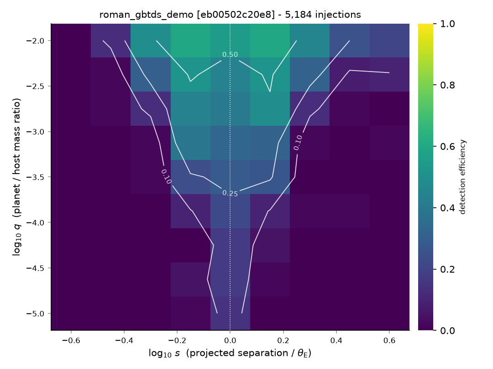
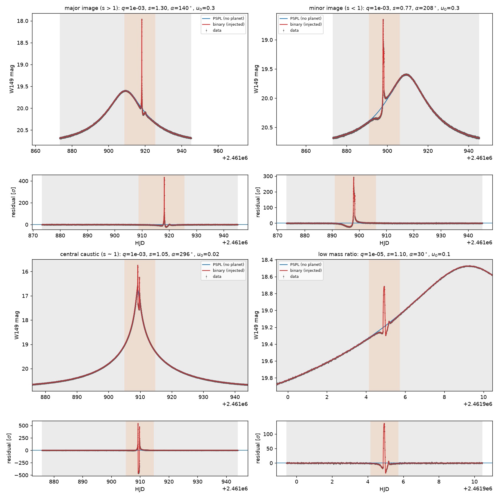

# lenseff

Detection efficiency for planetary microlensing surveys, by injection-recovery.

`lenseff` injects binary-lens (planetary) perturbations into single-lens light
curves on a real observing calendar, runs a detection pipeline over them, and
aggregates the recoveries into an efficiency surface in the (log *q*, log *s*)
plane with binomial uncertainties. The target application is the Nancy Grace
Roman Space Telescope's Galactic Bulge Time Domain Survey; nothing in the
library is Roman-specific, and surveys are described entirely by configuration.



## The methodological commitment

The detection statistic is

```
Δχ² = χ²(best free PSPL refit) − χ²(binary-lens model)
```

where the refit lets **every** PSPL parameter float — `t_0`, `u_0`, `t_E`, and
the fluxes `f_s`, `f_b`. A free single-lens fit partially reabsorbs a planetary
anomaly, so comparing against the *injected* PSPL parameters instead of a refit
substantially overestimates efficiency. That is the most common error in this
class of code, and avoiding it is the reason this package exists.

How much it matters, measured here (`test_the_refit_reabsorbs_part_of_the_anomaly`):

| injected planet | Δχ² vs refit | Δχ² vs injected PSPL | inflation |
| --- | ---: | ---: | ---: |
| `q=1e-2, s=1.3` (strong) | 6,045,924 | 6,444,352 | ×1.07 |
| `q=1e-3, s=1.3` | 1,687,523 | 1,691,515 | ×1.00 |
| `q=1e-4, s=1.0` | 50 | 82 | ×1.6 |
| `q=1e-3, s=0.6` (marginal) | 28 | 109 | **×3.9** |

The error is negligible for anomalies nobody would miss, and largest exactly in
the marginal regime that decides where the efficiency contour falls.

## Install

```bash
python -m venv .venv && source .venv/bin/activate
pip install -e ".[dev]"
```

Python 3.11+. All magnification calculations are delegated to
[MulensModel](https://github.com/rpoleski/MulensModel); `lenseff` never
implements a lens equation, a magnification, or a finite-source integral of its
own.

## Quickstart

```bash
lenseff validate configs/roman_gbtds_demo.yaml   # check a config before spending compute
lenseff show configs/roman_gbtds_demo.yaml       # print the resolved config and its hash
lenseff lightcurve configs/roman_gbtds_demo.yaml -o lc.png    # one event on the real calendar
lenseff run configs/roman_gbtds_demo.yaml        # the full sweep, surface and figures
```

The demo config is 5,384 injections and finishes in about six minutes on four
cores. [`docs/tutorial.ipynb`](docs/tutorial.ipynb) walks through the same
pipeline one step at a time.

## How it works

| module | what it owns |
| --- | --- |
| `config.py` | YAML → validated frozen dataclasses; unknown keys are errors |
| `presets.py` | named survey presets, resolved into explicit values before hashing |
| `rng.py` | random streams addressed by key path, never by sequence position |
| `survey.py` | observing calendar, season windows, photometric error model |
| `events.py` | baseline PSPL event population, or a supplied catalog |
| `inject.py` | binary-lens perturbation, anomaly window, shared noise realisation |
| `detect.py` | the multi-start PSPL refit, Δχ², and the criteria |
| `grid.py` | parallel sweep, checkpointing, resume |
| `efficiency.py` | per-cell aggregation with Wilson score intervals |
| `plotting.py` | contour maps, slices, light-curve and anomaly diagnostics |
| `cli.py` | `lenseff validate | show | lightcurve | run` |
| `provenance.py` | config hash, versions, git commit embedded in every parquet |

### Anomaly morphologies

`python examples/anomaly_gallery.py` renders the textbook cases and is the
visual check that the injection does what it claims:



Top left, a **major-image** perturbation (`s > 1`): a single sharp positive
spike. Top right, a **minor-image** perturbation (`s < 1`): the characteristic
demagnification dip immediately before the caustic spike. Bottom left, a
**central-caustic** perturbation on a high-magnification event, sitting on the
peak itself. Bottom right, `q = 1e-5`, short and weak — the regime where an
under-fitted PSPL refit would most badly inflate the efficiency.

## Detection criteria

Configurable, with these defaults (`detection:` in the config):

| criterion | key | default |
| --- | --- | --- |
| χ² improvement over the free PSPL refit | `delta_chi2_min` | 160 |
| consecutive points deviating from the refit | `consecutive_points` | 3 |
| per-point significance of that run | `point_sigma` | 3.0 |
| run must share a sign | `require_same_sign` | true |
| run must not bridge a time gap | `max_gap_within_run_days` | 0.25 |
| deviation must fall inside an observing season | `require_in_season` | true |

The thresholds are scientific judgements, not implementation details.
[`docs/detection-criteria.md`](docs/detection-criteria.md) states what each one
buys, what it costs, and — with numbers from the demo run — what the
consecutive-points requirement actually rejects.

Every criterion is stored per injection, so the surface can be re-thresholded
from the output table without recomputing the grid.

## Validation

The six tests that make the package trustworthy live in
`tests/test_validation.py` and gate CI as their own job:

1. **`q = 0` controls.** `Δχ² ≤ 0` for every planet-free injection, exactly —
   the refit family contains the injected model, so a free refit can only fit
   at least as well as the truth. The χ² criterion's false-positive rate is
   therefore zero *by construction*, not merely small. The rate that genuinely
   exists belongs to the consecutive-points criterion, and it matches its
   closed form to Poisson error on 4,000 synthetic light curves.
2. **Efficiency rises with `q`** at fixed `s`.
3. **Efficiency peaks in the lensing zone** near `s = 1` and falls off toward
   close and wide separations.
4. **Better photometry buys planets**: halving every σ raises efficiency,
   quartering raises it further.
5. **An anomaly in a season gap is never recovered**, while the same planet on
   the same event in season is.
6. **A published configuration is recovered** — approximately
   OGLE-2005-BLG-390Lb (`q = 7.6e-5`, `s = 1.61`).

## Reproducibility

* **Config-driven.** Nothing scientific is hard-coded. Unknown keys are an
  error, not a silently ignored setting.
* **Addressed RNG.** Every draw comes from a generator addressed by a stable
  key path, never a shared sequential stream, so results do not depend on
  worker count or task order — asserted by a test that runs the same sweep on
  one worker and on three and compares the tables.
* **Provenance in the output.** Each parquet file embeds the resolved
  configuration, its SHA-256, the seed, the git commit, and the versions of
  every dependency that can move a number.

Same config hash plus same seed ⟹ bit-identical data columns. See
[`docs/reproducing.md`](docs/reproducing.md).

## Compute

One injection-recovery cycle costs about 166 ms (43 ms injection, 123 ms
detection). Measure it on your own hardware with `python examples/timing.py`
before launching a large grid; `docs/compute-budget.md` has the scaling table
and the levers worth pulling.

| config | injections | CPU-hours | 8 cores |
| --- | ---: | ---: | ---: |
| `roman_gbtds_demo.yaml` | 5,384 | 0.25 | 2 min |
| `roman_gbtds_full.yaml` | 3,070,400 | 141 | 18 h |

## Documentation

* [`docs/configuration.md`](docs/configuration.md) — every configuration key.
* [`docs/detection-criteria.md`](docs/detection-criteria.md) — criteria, rationale, decisions.
* [`docs/compute-budget.md`](docs/compute-budget.md) — cost per injection and grid sizing.
* [`docs/reproducing.md`](docs/reproducing.md) — reproducing a published map.
* [`docs/tutorial.ipynb`](docs/tutorial.ipynb) — the whole pipeline, end to end.

## Known limitations

* The PSPL refit does not include microlensing parallax or lens orbital
  motion. Efficiency for anomalies with timescales approaching `t_E` is
  therefore an upper bound. See `docs/detection-criteria.md`, decision (b).
* χ²(binary) is evaluated at the injected parameters rather than fitted. That
  is the standard injection-recovery formulation and it is what makes the
  package affordable; it also means the Δχ² criterion has no false-alarm rate
  to measure. Decision (a).
* The Roman preset numbers are provisional and flagged in `lenseff/presets.py`.
  Check them against Penny et al. (2019) and the current GBTDS definition
  before using this for science.
* Limb darkening is not modelled; the source is uniform.

## License

MIT.
